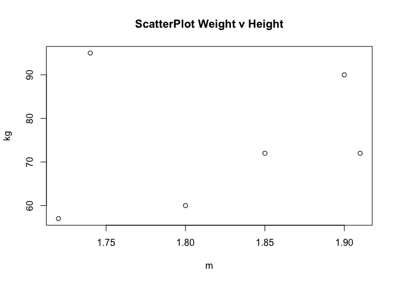

# Live Session 02 Assignment
Oscar Padilla  
May 20, 2016  

## Calculation Questions
### Use R to calculate the following:
Answers in *italic*

### 1. Basic Math
+ The log of a positive number

```r
log(2.718281828)
```

```
## [1] 1
```
+ What is the default base for the log function? Calculate the log of your previous number with a different base

*The default base for the log function is $e$, thus $log = ln$*

```r
log(2.718281828,10)
```

```
## [1] 0.4342945
```
+ The log of a negative number (explain the answer)

*The logarithm of a negative number is undefined*

```r
log(-100,10)
```

```
## Warning: NaNs produced
```

```
## [1] NaN
```
+ The square-root of a positive number

```r
sqrt(25)
```

```
## [1] 5
```
### 2. Random number generation
+ Create a vector of 15 standard normal random variables. Calculate its mean and SD

```r
randomvector <- rnorm(n=15)
randomvector
```

```
##  [1] -0.63772774  0.26233670  0.77207299 -0.13067469  1.42106641
##  [6] -0.24699775 -0.46763451 -0.62435571 -0.16892638 -0.01135788
## [11]  0.88474632  0.95008231  1.27088563  0.98594689 -0.40784978
```

```r
mean(randomvector)
```

```
## [1] 0.2567742
```

```r
sd(randomvector)
```

```
## [1] 0.7199363
```
+ Change the mean to 10 and the SD to 2 and recalculate the vector of 15 random normal variables. Calculate its mean and SD

```r
randomvector <- rnorm(n=15,mean=10,sd=2)
randomvector
```

```
##  [1]  8.039888  9.878521  6.745298 10.857924  9.042244 13.743073  9.825091
##  [8] 12.086704 11.548965 11.378631  8.575158 12.731665 10.606266  7.174859
## [15] 11.776954
```

```r
mean(randomvector)
```

```
## [1] 10.26742
```

```r
sd(randomvector)
```

```
## [1] 2.048077
```
+ Why are the means and SD not exactly the same as the means and SDs specified in the function?

*The mean and sd of a set of randomly generated numbers will convey towards the nominal mean and sd as n increases in size*

### 3. Vector Operations
+ The weights of 6 individuals in kg are 60, 72, 57, 90, 95, 72

```r
weights <- c(60, 72, 57, 90, 95, 72)
```
+ Their heights (in m) are 1.80, 1.85, 1.72, 1.90, 1.74, 1.91

```r
heights <- c(1.80, 1.85, 1.72, 1.90, 1.74, 1.91)
```
+ Enter these vectors into R

```r
h_w_table <- data.frame(heights,weights)
h_w_table
```

```
##   heights weights
## 1    1.80      60
## 2    1.85      72
## 3    1.72      57
## 4    1.90      90
## 5    1.74      95
## 6    1.91      72
```
+ Create a scatterplot of weight vs. height. Interpret the scatterplot.

```r
plot(x = heights,y = weights, main= "ScatterPlot Weight v Height", xlab = "m", ylab = "kg")
```

<!-- -->

+ Calculate the BMI for each individual (BMI = weight in kg divided by the square of the height in m)

```r
BMI <- weights/(heights^2)
BMI
```

```
## [1] 18.51852 21.03725 19.26717 24.93075 31.37799 19.73630
```
+ Calculate the mean for weight

```r
avgweight <- mean(weights)
avgweight
```

```
## [1] 74.33333
```
+ Subtract the mean from each value of weight

```r
weights-avgweight
```

```
## [1] -14.333333  -2.333333 -17.333333  15.666667  20.666667  -2.333333
```
+ Sum the result. Now you know why we square the deviations from the mean to calculate a standard deviation!

```r
round(sum(weights-avgweight), digits=2)
```

```
## [1] 0
```
*By definition, the net sum of all deviations from the mean will be zero*
